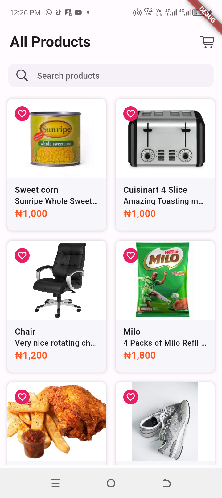

# HNG Task 2

This is a single page mobile app which calls a Timbu Api to get listed products and populates the "All Products" screen
with the details of these products including product image.

- **Usage:**
1. All Products: Displays list of products

## Features
- Product listing
- Search products

## Installation

Follow these steps to set up the project locally:

1. **Clone the repository:**

   git clone https://github.com/Damigrace1/HNG-task-2.git
   
   cd hngtask2

2. **Install Flutter dependencies**
   flutter pub get

3. **Run the app**
   flutter run

## Screenshots

1. **Products List**
   

- **Appetize Link:** (https://appetize.io/app/b_qgsleqquctpdjpw5mjbk7xuep4).
- **APK Download:** (https://drive.google.com/file/d/1nYypYeAk6vp4uvr3fhR3hFPpPbIqzCOL/view?usp=drivesdk).
- **Contact Information:**
- **Name**:`Damilare Ogunwehin`
- **Slack Username**:`White Developer`
- **Email**:`whitedeveloper1@gmail.com`
- **GitHub**:(https://github.com/Damigrace1/HNG-task-2)

